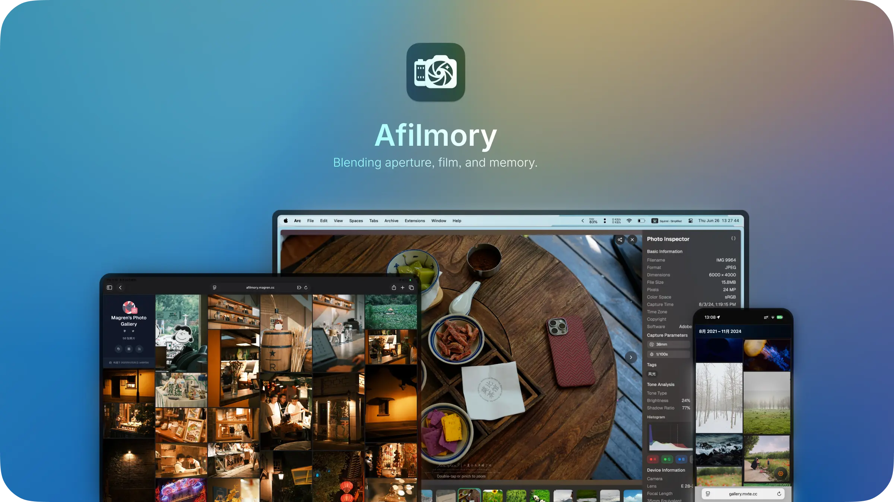

- [中文文档](README.md) | [English Docs](README_en.md)

<p align="center">
  
</p>

# <p align="center">Afilmory</p>

Afilmory (读音 /əˈfɪlməri/, "uh-FIL-muh-ree") 是一个为个人摄影网站创造的术语，融合了自动对焦（Auto Focus，AF）、光圈（光线控制）、胶片（复古媒介）和记忆（捕捉的瞬间）。

一个现代化的照片画廊网站，使用 React + TypeScript 构建，支持从多个存储源（S3、GitHub）自动同步照片，具有高性能 WebGL 渲染、瀑布流布局、EXIF 信息显示、缩略图生成等功能。

***注意***：本项目为原作者开源项目的 fork 版本，原作者开源地址：[https://github.com/Afilmory/afilmory](https://github.com/Afilmory/afilmory)

在线照片画廊示例：

- https://pix.tanmantang.com
- https://afilmory.innei.in (作者)
- https://gallery.mxte.cc
- https://photography.pseudoyu.com
- https://afilmory.magren.cc

## 🌟 功能特性

### 核心功能

- 🖼️ **高性能 WebGL 图像渲染器** - 自定义 WebGL 组件，支持平滑缩放和平移操作
- 📱 **响应式瀑布流布局** - 基于 Masonic，适应不同屏幕尺寸
- 🎨 **现代 UI 设计** - 使用 Tailwind CSS 和 Radix UI 组件库构建
- ⚡ **增量同步** - 智能变更检测，仅处理新增或修改的照片
- 🌐 **国际化** - 多语言支持 【新增页面选择翻译】
- 🔗 **OpenGraph** - 社交媒体分享的 OpenGraph 元数据
- 🌓 **暗色模式支持** - 支持配置文件级更换亮色/暗色模式 【新增】

### 图像处理

- 🔄 **HEIC/HEIF 格式支持** - 自动转换 Apple 设备的 HEIC 格式
- 📷 **TIFF 格式支持** - 自动转换 TIFF 格式
- 🖼️ **智能缩略图生成** - 多尺寸缩略图，优化加载性能
- 📊 **EXIF 信息显示** - 完整的拍摄参数，包括相机型号、焦距、光圈等
- 🌈 **Blurhash 占位符** - 优雅的图像加载体验
- 📱 **Live Photo 支持** - 检测和显示 iPhone Live Photos
- ☀️ **HDR 图像支持** - 显示 HDR 图像

### 高级特性

- 🎛️ **富士胶片配方** - 读取和显示富士相机的胶片模拟设置
- 🔍 **全屏查看器** - 支持手势的图像查看器
- 🏷️ **文件系统标签** - 基于文件系统自动生成标签
- ⚡ **并发处理** - 多进程/多线程并发处理支持
- 🗂️ **多存储支持** - S3、GitHub 和其他存储后端
- 📷 **分享图像** - 分享图像到社交媒体或嵌入 iframe 到您的网站
- 🗺️ **交互式地图浏览器** - 使用 MapLibre 基于 EXIF 数据中的 GPS 坐标实现照片的地理可视化

## 🏗️ 技术架构

### 前端技术栈

- **React 19** - 最新的 React 版本，带有 Compiler
- **TypeScript** - 完整的类型安全
- **Vite** - 现代构建工具
- **Tailwind CSS** - 原子化 CSS 框架
- **Radix UI** - 可访问的组件库
- **Jotai** - 状态管理
- **TanStack Query** - 数据获取和缓存
- **React Router 7** - 路由管理
- **i18next** - 国际化

### 构建系统

- **Node.js** - 服务端运行时
- **Sharp** - 高性能图像处理
- **AWS SDK** - S3 存储操作
- **Worker Threads/Cluster** - 并发处理
- **EXIF-Reader** - EXIF 数据提取

### 存储架构

采用适配器模式设计，支持多种存储后端：

- **S3 兼容存储** - AWS S3、MinIO、阿里云 OSS 等
- **GitHub 存储** - 使用 GitHub 仓库作为图像存储

## 🚀 快速开始

### Docker 部署

[Docker 部署](https://github.com/Afilmory/docker)
[vercel 部署](https://vercel.com/)

## ⚙️ 配置选项

#### 远程仓库配置 (`repo`)

为了在 CI 中实现增量构建，需要配置一个缓存仓库，每次构建前会拉取缓存，构建后上传构建结果。

```json
{
  "repo": {
    "enable": true,
    "url": "https://github.com/username/gallery-assets"
  }
}
```

这将自动从远程仓库拉取资源，避免每次都重新构建。

**为了实现上传到 git 仓库，您需要提供 `GIT_TOKEN` 并将其写入 `.env` 文件。**

#### 存储配置 (`storage`)

- `provider`: 存储提供商 (`s3` | `github`)
- `bucket`: S3 存储桶名称
- `region`: S3 区域
- `endpoint`: S3 端点（可选）
- `prefix`: 文件前缀
- `customDomain`: 自定义域名
- `excludeRegex`: 排除文件的正则表达式（可选）

#### 构建选项 (`options`)

- `defaultConcurrency`: 默认并发数
- `digestSuffixLength`: 附加到照片 ID 的 SHA-256 摘要长度
- `enableLivePhotoDetection`: 启用 Live Photo 检测
- `showProgress`: 显示构建进度
- `showDetailedStats`: 显示详细统计信息

#### 性能配置 (`performance`)

- `worker.workerCount`: 工作进程数量
- `worker.timeout`: 工作进程超时（毫秒）
- `worker.useClusterMode`: 启用集群模式

#### 日志配置 (`logging`)

- `verbose`: 详细日志
- `level`: 日志级别 (`info` | `warn` | `error` | `debug`)
- `outputToFile`: 输出到文件

## 📋 命令行命令

### 构建命令

```bash
# 查看帮助
pnpm run build:manifest -- --help

# 增量更新（默认）
pnpm run build:manifest

# 强制完全更新
pnpm run build:manifest -- --force

# 只重新生成缩略图
pnpm run build:manifest -- --force-thumbnails

# 只重新生成清单
pnpm run build:manifest -- --force-manifest
```

### 开发命令

```bash
# 安装依赖
pnpm install

# 启动开发服务器
pnpm dev

# 构建生产版本
pnpm build
```

### 注意事项

- 确保您的 S3 存储桶中已包含照片文件
- 如果使用远程仓库，请先配置 `config.json`

## 🔧 高级用法

### 自定义存储提供程序

实现 `StorageProvider` 接口以支持新的存储后端：

```typescript
import { StorageProvider } from './src/core/storage/interfaces'

class MyStorageProvider implements StorageProvider {
  async getFile(key: string): Promise<Buffer | null> {
    // 实现文件检索逻辑
  }

  async listImages(): Promise<StorageObject[]> {
    // 实现图像列表检索逻辑
  }

  // ... 其他方法
}
```

### 自定义图像处理

在 `src/core/image/` 目录中添加自定义处理器：

```typescript
export async function customImageProcessor(buffer: Buffer) {
  // 自定义图像处理逻辑
  return processedBuffer
}
```